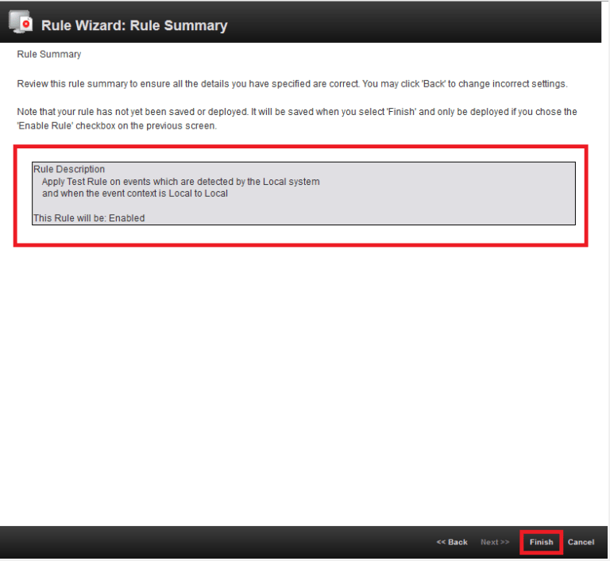
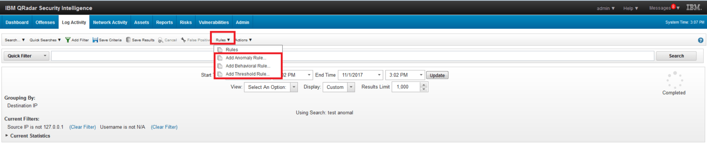

# Creating Rules in IBM QRadar

<aside>

# ⚠️ What is Rule ?

</aside>

> Rules are essential for detecting suspicious activities, security threats, and anomalous behaviors within a network. These rules define conditions based on log events and network flow data, and when those conditions are met, QRadar triggers actions, such as generating offenses, sending alerts, or logging events.
> 

1. The correct operation of any SIEM is not only updating the build, or 
collection and storage of events from various data sources.

1. The primary task of SIEM is to identify security incidents. The vendor provides 
preconfigured detection rules for IBM QRadar, but most often, these 
rules are templates that you need to change for your infrastructure, 
security policies, and incident response procedures.

1. Before writing the rules for detecting security incidents in the 
company’s infrastructure, you need successfully configure your SIEM, 
connect all data sources and fix parsing errors. Otherwise, you will 
have to re-write them.

1. It is necessary to understand what do you want to discover and what are the criteria for rule triggering.

- The rules can be divided into five categories:
    
    1. Rules based on events.
    
    2. Rules based on data flows.
    
    3. Rules based on events and data flows.
    
    4. Rules based on Offences.
    
    5. Finding deviations from normal behavior.
    

---

<aside>

##  1️⃣ Creating rules based on events

</aside>

## To create a rule, you need:

1. Go to → **Offenses → Rules → Actions → New Event Rule** tab.

---

2. Fill in the **Rule name** field. Add conditions. Set the value of the conditions. Select the group for this rule. Write **Notes**. Click **Next**.

---

3. After that, you need to specify **Rule Action**, **Rule Response**, **Rule Limiter** and **Enable Rule**. Click **Next**.

---

4. Opened window displays all the parameters and conditions that apply to the rule. If everything correct, click **Finish**.

---

<aside>

## 2️⃣ Creating rules based on data flows

</aside>

- This kind of rules allows you to analyze and correlate network events.

## To create such a rule, you must:

1. Go to **Offenses → Rules → Actions → New Flow Rule** tab.

## All other steps are the same as for **Event Rules**.

---

<aside>

##4️⃣ Creating rules based on events and data flows

</aside>

- Rules based on events and network data flows allow you to correlate fields from different kinds of data sources with similar fields in data flows.

## To create a rule, you need:

1. Go to **Offenses → Rules → Actions → New Common Rule** tab.

---

## 2. All other steps are the same as for **Event Rules**.

---

<aside>

##5️⃣ Detecting deviations from the normal behavior

</aside>

- Rules for detecting deviations from the normal behavior are based on search requests. The request has to correspond to a specific format and should describe what is the normal behavior.

- To create such a rule, you need to create a **Search** that describes the normal behavior. A mandatory criterion for creating a search is aggregation over one or more fields. (Note: do not forget to save created **Search**).

- Then you need to run it.
- After that, click **Rule** tab and select one of the rule types, as shown in the picture below.

---

- Finally, you need to specify the conditions for triggering the rule as it was in **Creating rules based on events** section.
- The usage of rules allows your SIEM automatically uncover anomalies in users behavior and detect specific security incidents. Processing of rule triggering results reduces SIEM administrator’s burden and allows to increase the security level within the organization.
- Save hours on threat hunting and content development and boost your security effectiveness by reaching the most up-to-date detections enriched with [CTI](https://www.paloaltonetworks.com/cyberpedia/what-is-cyberthreat-intelligence-cti) and aligned with [MITRE ATT&CK](https://attack.mitre.org/) on the SOC Prime Platform.

---

<aside>

🧑🏻‍💻 Creator : Mohamed Saber 

</aside>
